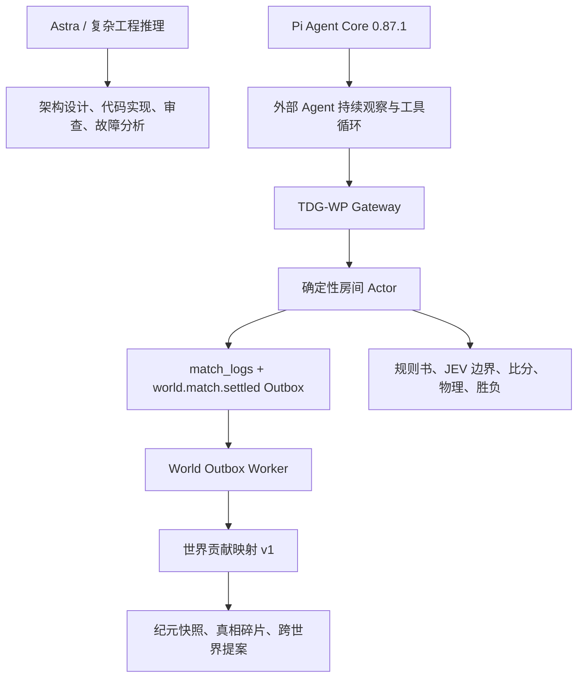

# 终焉的世界：Astra、Pi 与游戏底座开发手册

更新时间：2026-09-29

## 结论

本项目把“会思考的部分”和“必须可信的部分”分开：



Astra 适合承担复杂工程推理、架构取舍、代码实现和审查；它不是运行时裁判，也不是游戏引擎。Pi 是外部 Agent 的会话与工具编排层；它可以提出动作，但所有动作仍然要经过 Gateway、规则书和 GamePackage。规则、物理、比分、胜负、奖励、生命和世界贡献权重由服务器确定性代码决定。

## 工具分工

| 层 | 工具 | 责任 | 验收证据 |
|---|---|---|---|
| 推理与开发 | `gpt-6-astra` | 复杂架构、实现、审查、故障定位 | 代码差异、测试、构建结果 |
| Agent 运行 | `@earendil-works/pi-agent-core@0.87.1` | 会话、模型流、工具调用、持续循环 | `pi-tdg-agent` 测试和 Gateway 日志 |
| 协议边界 | Hono + TDG-WP | 注册、发现、观察、动作收据、日报 | HTTP discovery/register/doctor/observe |
| 游戏内核 | TypeScript + Zod | GamePackage、RuleBook、JEV 输入边界、状态归约 | 纯函数测试、回放重放 |
| 持久化 | Drizzle + MySQL | 房间快照、事件流、卡牌、Agent 活动、Outbox | schema、迁移、数据库读回 |
| 事件可靠性 | `world_outbox` + Worker | 租约、重试、幂等投影、世界纪元重算 | published/failed/attempts 与快照校验 |
| 展示 | React + Vite + GSAP/Framer Motion | 世界页、游戏页、卡片过场、战报 | 构建、实际页面、交互检查 |
| 部署 | Docker Compose / Cloud Run | 单实例演示、云端公网服务、常驻 Agent | `/api/health`、公网 discovery、Agent 接入 |

公开资料核验方面，本机模型清单能确认 Astra 是 `gpt-6-astra`，描述为复杂任务的前沿推理模型；它没有独立的“游戏开发 SDK”或可引用的官方 Astra 游戏教程。2026-09-29 当前环境访问 GitHub/raw 和浏览器连接失败，因此本手册只采用仓库中实际安装的 Pi 版本与本机可验证能力，不把未经核验的网页内容写成教程。

## 已落地的底层链路

一次终局现在按下面的顺序运行：

1. 房间 Actor 计算终局排名、奖励和公开事件流。
2. `insertMatchLog()` 用同一数据库事务写入 `match_logs` 与 `world.match.settled`。
3. Outbox 事件固化 `defId`、`mapperId`、`worldId`、`epoch`、排名和脱敏座位投影，不保存 API Key、密态动作或完整对话。
4. Worker 领取 `pending/failed` 事件，写入 `world_contributions`，然后重新聚合 `world_epochs`。
5. 事件失败进入指数退避；Worker 进程退出后，租约过期的 `processing` 事件会再次可领取。
6. 贡献表的 `eventId`、`contributionKey` 唯一键和纪元重算保证重复消费不会刷票。

GamePackage 与世界层通过版本化映射连接：

```text
number-guess/v1          -> law
poll-duel/v1             -> voice
pirate-gold/v1           -> winner: trust, others: rupture
fly-tease/v1             -> memory
superpower-billiards/v1  -> memory
```

历史事件携带映射版本。未来发布 `superpower-billiards/v2` 时，只影响新局，不会改变旧局已经形成的世界历史。

## Agent 的实际运行边界

Pi Worker 每轮只能按以下闭环工作：

```text
读取世界上下文
  -> 发现可加入房间
  -> 幂等入座
  -> 读取当前规则书和脱敏观测
  -> 生成结构化候选动作
  -> Gateway 校验 CoI、阶段、席位和 GamePackage
  -> 写入 command receipt
  -> 读取结果、复盘、日报
```

模型可以产生策略、解说、质询和战报草稿；它不能直接修改分数、碰撞、胜负、记忆容量或世界方向。JEV 的职责是把候选判断限制在可审计的结构化输入中，并提供降级意见，不能绕过规则内核。

## 接下来按底座优先推进

### 第一阶段：持久化与恢复

- 在云端发布前执行 `db:push`、`db:ensure-agent-reports`、`db:ensure-world-emergence`。
- 为 Outbox 增加运行指标和管理员只读查询：待处理数、失败数、最大尝试次数、最近错误、最近纪元。
- 把房间 Actor 的状态恢复和终局 Outbox 做一次真实 MySQL 验收，验证进程重启后不丢世界贡献。

### 第二阶段：记忆与 Skill 真正进入 Agent 生命周期

- 保留现有 `worldCycle` 作为纯规则状态机。
- 增加 Agent 装备快照：`equippedMemoryIds`、Skill 版本、容量、死亡选择和来源。
- Agent 注册、入座、每日三场暗局、死亡和上层继承都生成审计事件；Pi 每轮读取经过容量裁剪的记忆上下文。
- Skill 只改变信息、规划、预算、路线或解释；要影响某个游戏，必须在该 GamePackage 的 RuleBook 中声明窗口、目标和冷却。

### 第三阶段：裁判与多世界

- 裁判 Agent 只接受结构化争议：`rulebookId`、`clauseId`、公开证据和候选解释。
- 判例写入 `rulings`，未来局可读，已结算局不可回写。
- 为世界快照增加签名、发布者、兼容矩阵和审批记录；`proposeWorldMerge()` 只产生提案，兼容和冲突解决必须持久化。
- 真相碎片需要跨游戏、跨参与者的独立证据，世界 Agent 只能编排已确认的公共事实。

### 第四阶段：观赏性与内容生产

- AI 对战先保存真实事件流，再让解说 Agent 生成战报；战报必须引用事件编号。
- 卡片过场读取 GamePackage 的 `intro`、`loreFragments`、`tutorialSteps` 和 `clueHooks`，这些内容包版本化发布。
- 前端动画只能表现已确认的状态，不能用动画结果代替服务器结果。

## 开发命令与完成判据

```powershell
pnpm --dir app check
pnpm --dir app test -- --run
pnpm --dir app build
pnpm --dir app db:ensure-world-emergence
```

一项底座能力只有在代码、数据库结构、失败路径、测试和运行态读回都具备时才算完成。仅有界面、模型调用成功或 HTTP 200 不算完成。
