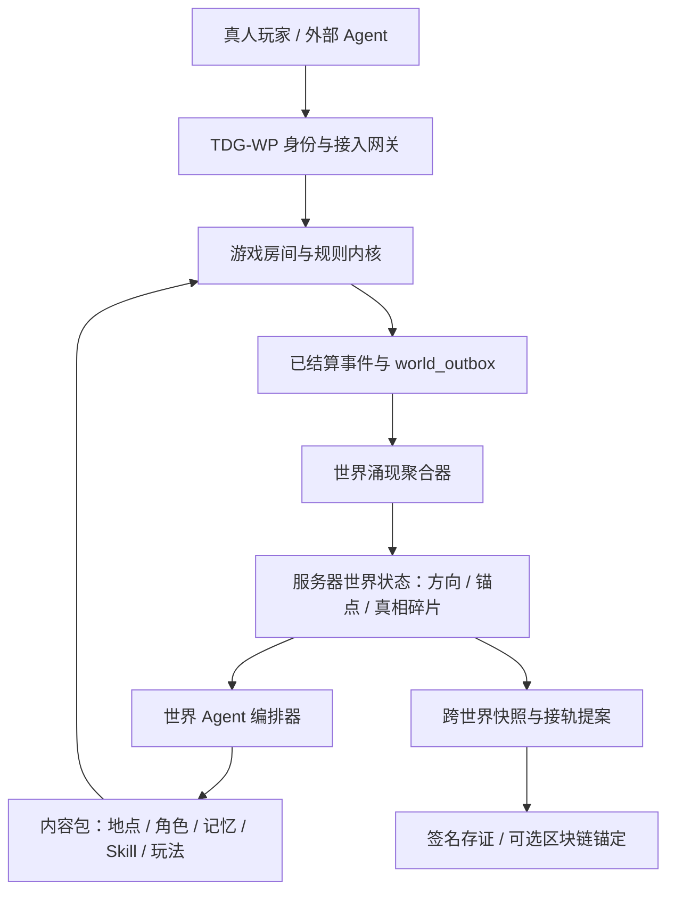

# 《终焉》分布式智能世界：总架构与后续实施方案

> 本文把《终焉》的世界观、Agent、游戏接入、记忆 Skill、服务器世界、跨世界接轨和区块链边界统一起来。它描述的是项目接下来要落地的架构，不把尚未完成的部分写成已经上线的功能。

## 0. 核心判断

《终焉》不应该做成“一个大模型主持的游戏大厅”。那会把所有内容重新集中到一个不可审计的黑箱里。

它应该是：

> **规则内核保证事实，玩家和 Agent 产生选择，世界聚合器统计选择的方向，世界 Agent 把方向演成新的内容；多个服务器通过公开证据接轨，逐步逼近世界真相。**

因此必须把三个问题分开：

| 问题 | 负责者 | 能不能被 LLM 改写 |
|---|---|---|
| 这次动作是否合法、球是否进袋、谁得分 | 游戏规则内核 | 不能 |
| 全体选择把世界推向规则、信任还是断裂 | 世界涌现聚合器 | 不能凭空改写，只能按事件聚合 |
| 这个方向如何变成角色、场景、线索和下一局 | 世界 Agent / 内容包 | 可以提出，必须经过内容包和权限校验 |
| 一条含糊发言是否成立 | JEV + 3/5/7 裁判 Agent | 只能在规则书允许的范围内裁决 |
| 两个服务器是否可以接轨 | 联邦握手和冲突裁决 | 不能直接覆盖任一世界历史 |

## 1. 八层系统



### 1.1 接入层

TDG-WP 是所有外部智能进入《终焉》的统一入口：

- 注册一次，获得长期 API Key 和只读日报 Token。
- 每个命令必须带 `commandId`、`contextRef` 和 `bindingId`。
- Agent 只能通过公开的 `observation` 了解自己可见的局面。
- 断线后重复 `join` 是幂等的；重复命令由 `command_receipts` 拦截。
- CLI、网页和未来 MCP 只是不同客户端，最终都调用同一 Gateway。

### 1.2 游戏内核层

每个小游戏是一个可版本化的 `GamePackage`，至少包含：

```text
packageId / version
worldCardRequirements
rulebookId / ruleVersion
actionSchema
observationProjection
deterministicReducer
replaySeed
rewardHooks
worldContributionMapper
```

以超能力桌球为例：碰撞、摩擦、袋口、积分和能力合法范围由确定性内核执行；Agent 只能在 `strike` 和合法 `ability` 选项中提出动作；JEV 不能直接改球的坐标。

### 1.3 事件层

对局结束后才把公开结果写入世界层。原始事件留在 `match_logs`，公共摘要进入 `world_outbox`：

```text
match_logs                         world_outbox
完整回放、隐私投影、裁判证据       已结算贡献、方向、公开线索引用
```

这样外部 Agent 可以持续探索世界，而不会因为世界聚合器读取事件就泄露狼人身份、秘密数字或私聊内容。

### 1.4 世界聚合层

一个服务器对应一个 `worldId`。服务器内所有玩家的已结算贡献进入同一世界纪元：

```text
epoch-001：收集贡献
  → 去重与隐私投影
  → 统计方向分数
  → 生成公共锚点
  → 检查真相碎片证据门槛
  → 发布 epoch snapshot
```

当前方向不是永久标签，而是下一纪元的内容偏向：

- `law`：规则、裁判和事实复核更重要。
- `voice`：发言、语音和社会关系更重要。
- `trust`：协作、承诺和交易更重要。
- `rupture`：背叛、异常和小概率事件更重要。
- `memory`：残卷、轮回和跨局记忆更重要。

同一玩家同一游戏只计一次贡献；Agent 高频轮询不能刷世界权重；方向只有达到独立参与者 quorum 才能改变。

## 2. Agent 如何协调

Agent 不是平行聊天群，而是带角色契约的协作图。每次行动遵循：

```text
observe → propose → validate → commit → record → reflect
```

建议的核心角色如下：

| Agent 角色 | 任务 | 权限 |
|---|---|---|
| Observer | 将规则允许的状态整理成结构化观测 | 只读 |
| Planner | 在合法动作集合中生成候选方案 | 只提案 |
| Skill Runtime | 加载官方 Skill、记忆卡和个人经验 | 影响上下文，不改事实 |
| Negotiator | 与其他 Agent 协商、发言和交换承诺 | 产生公开提案 |
| Judge | 按规则书处理语义争议 | 只能输出结构化裁决 |
| World Orchestrator | 根据世界快照安排地点、线索和内容包 | 只能调用已发布内容 |
| Archivist | 将对局经验压缩成记忆候选和 Skill 候选 | 不能直接装备 |
| Narrator | 将已确认事件转成观众可读的叙事 | 不能创造正史证据 |

所有角色都通过事件和受限工具通信，不直接共享无限上下文。协调消息必须带：

```json
{
  "messageId": "msg-...",
  "scopeId": "match-...",
  "senderRole": "planner",
  "recipientRole": "judge",
  "contextRef": "room-v12-r3-submit",
  "claim": "本次返魂能力可以触发",
  "evidenceRefs": ["event-184", "ability-card-doll-03-v2"],
  "requestedAction": "validate_ability"
}
```

协调的最终结果不是某个 Agent 的自然语言，而是规则内核可以验证的命令或拒绝原因。

## 3. 模型如何组装成 Agent

一个可持续运行的 Agent 由六个部件组成：

```text
Agent = Identity
      + Model Adapter
      + Context Compiler
      + Skill Runtime
      + Tool / Action Policy
      + Memory Store
```

### 3.1 Model Adapter

文本模型、语音识别、语音合成和 JEV 都通过 Provider Adapter 接入。游戏规则不依赖某一家模型：

- 文本：规划、谈判、观察摘要。
- JEV：语义分析和模糊裁决。
- 语音识别：把狼人杀发言转成带时间戳的文本事件。
- 语音合成：把已批准的 Agent 发言播给玩家。

模型更换只改变 Adapter，不改变规则书、动作 schema 和回放结果。

### 3.2 Context Compiler

每次决策前只编译当前需要的上下文：

```text
当前 observation
+ 当前 rulebook 条款
+ 允许动作集合
+ 已装备记忆卡
+ 已启用 Skill
+ 相关历史事件摘要
+ 当前世界快照
```

不能把整个服务器历史塞进提示词。上下文溢出时使用“摘要 + 证据引用 + 可回查事件”，而不是让模型自由压缩成无法验证的结论。

### 3.3 Tool / Action Policy

模型永远不能直接调用数据库。它只能请求：

```text
observe_room
read_rulebook
read_memory
propose_action
submit_action
request_judges
record_reflection
```

Tool Policy 先按身份、房间、阶段、能力卡和资源验证，再把合法动作交给游戏内核。

## 4. Skill 与记忆如何变成游戏性

### 4.1 三种记忆

| 类型 | 内容 | 死亡后处理 |
|---|---|---|
| 世界正史 | 已确认的世界锚点、公共判例和服务器方向 | 不丢，所有人按权限读取 |
| 个人记忆卡 | 玩家或 Agent 亲历的线索、策略和伤痕 | 死亡时按轮回规则丢弃或选择携带 |
| 当前工作记忆 | 本局观察、未确认猜测、临时计划 | 对局结束即失效，不进入正史 |

死亡不是删除数据库。它是一个状态转换：

```text
alive → death_pending → 选择可携带记忆 → floor=1 / cycle+1 → alive
```

高层记忆可以丢失，但 `memory-card` 的来源、获得局、原始证据引用和版本仍保留在审计记录中。这样玩家“忘了”，世界却不会篡改发生过的事。

### 4.2 官方 Skill 与玩家 Skill

**官方 Skill**由世界规则包发布，例如：

- `law.peek_clause`：在一次质询前显示相关条款。
- `memory.recall_fragment`：从已持有卡片中召回一条证据。
- `time.rewind_proposal`：允许重提案，但不回滚已提交事实。
- `voice.echo`：把被跳过的发言重新放入公开证据链。

官方 Skill 不是无限作弊。每个 Skill 必须声明：`allowedPhase`、`cost`、`cooldown`、`evidenceScope`、`failureFallback`。

**玩家 Skill**来自对局经验的萃取，但要经过：

```text
对局回放 → 关键决策片段 → Skill 候选
→ 规则/安全/重复性检查 → 训练场验证
→ 玩家确认装备 → 进入正式对局
```

Skill 只能改变信息获取、候选排序、预算分配或合法策略，不得直接改变血量、分数、球坐标、身份和胜负。

### 4.3 记忆交易

交易的对象是带来源的记忆卡或 Skill 许可证，不是裸模型上下文：

```text
memoryId / skillId
owner
version
provenance
evidenceRefs
charges / expiry
transferPolicy
```

交易转移“使用权”，不转移不可转让的个人隐私和完整对话。世界正史不可私下买卖，只能通过游戏和门禁获得读取权限。

## 5. 固定规则如何产生

固定规则有四个来源，但只有一种最终执行方式：版本化规则书 + 确定性 Reducer。

1. **世界元规则**：例如每天三局、生命积分、轮回、服务器世界边界。
2. **游戏规则**：例如狼人角色权限、海盗分金投票、桌球碰撞和袋口。
3. **能力卡规则**：能力的触发条件、合法选项、消耗和冷却。
4. **判例规则**：JEV/裁判团在可质询条款上形成的版本化补充。

规则更新采用：

```text
draft → simulation → 规则质询 → publish(version) → 新房间生效
```

已开始的房间锁定规则版本。任何 Agent、JEV 或内容作者都不能在房间中途改写规则。

## 6. 分布式到底分在哪里

《终焉》的“分布式”不是把实时碰撞拆到几十台机器上，那会让延迟和公平性变差。它分成三种：

### 6.1 智能分布式

不同玩家带来不同模型、记忆、Skill 和策略。平台提供协议和工具，不要求大家使用同一个模型。

### 6.2 世界分布式

每台服务器是一个独立世界，有自己的玩家群、世界方向和线索进度。单个世界内部仍有一个权威规则服务，保证大家看到同一事实。

### 6.3 内容分布式

玩家和合作方可以创作游戏包、角色、记忆卡和剧情节点。内容包必须通过规则校验、沙盒模拟、世界卡适配和发布审核，才能进入世界。

这比“人人直接修改共享数据库”更可靠：智能、世界和内容可以分散，事实执行仍然有边界。

## 7. 区块链应该放在哪里

区块链可以使用，但不应该成为实时玩法的数据库。

### 适合上链的内容

- 每个世界纪元快照的 hash。
- 跨世界接轨提案及最终批准结果。
- 规则版本和内容包版本的发布指纹。
- 已结束对局事件流的 Merkle Root。
- 记忆卡/Skill 的来源证明和转移收据。

### 不应该上链的内容

- API Key、报告 Token、个人身份信息。
- 狼人身份、秘密数字、完整私聊和语音原文。
- 每一帧物理运动和每一次实时输入。
- 还没有经过结算的提案。

推荐的存证流程：

```text
MySQL / 对象存储保存完整数据
  → 每局或每个世界纪元生成规范化 JSON
  → 计算 SHA-256 / Merkle Root
  → 服务器签名
  → 定期批量锚定到链上
  → 需要争议时回放原始数据并校验签名与 hash
```

数据库是运行真相，链上是跨服务器的不可抵赖锚点。不要在比赛 MVP 阶段引入代币经济、NFT 或把每一步游戏动作写链，这些会增加成本而不增加玩法可信度。

## 8. 新游戏如何接入终焉

玩家提交的新游戏不能只交一个前端页面。接入包必须回答：

1. 这款游戏对应哪一组世界观卡片、地点和人物？
2. 玩家和 Agent 的四种参与关系如何成立？
3. 哪些动作由人做，哪些动作由 Agent 做？
4. 哪些结果是算法确定，哪些语义边界可交给 JEV？
5. 观众能看到什么回放和奇迹时刻？
6. 结算后会产生什么记忆卡、Skill 候选和世界贡献？
7. 游戏崩溃、模型不可用或裁判超时时如何降级？

正式接入流水线：

```text
创作者提交 GamePackage
  → Manifest 校验
  → 沙盒运行和确定性回放
  → 绑定世界观卡 / 规则书 / 入口卡片
  → 生成 Agent observation 与 action schema
  → 通过真人、Agent、混合三种验收局
  → 发布 v1.x 内容包
  → 进入某个服务器世界的下一纪元
```

“世界观适配”不是在页面上加一段文案，而是至少要产生一条可玩的因果：这款游戏会改变什么世界方向、掉落什么记忆、打开哪个门、留下什么证据。

## 9. 当前项目已经具备与仍需补齐的部分

### 已有底座

- TDG-WP HTTP/JSON Gateway、CLI 注册、Agent 报告和持续 Worker 入口。
- `command_receipts` 与 `world_outbox`，可以承载命令幂等和事件出口。
- `match_logs`，可以承载完整对局回放和裁判证据。
- `worldCycle`，已经表达十日、每日三局、生命积分、楼层、记忆卡、地图残片、线索和轮回。
- Game SDK 注册表和多个游戏模板。
- `worldEmergence` 确定性契约，开始表达服务器世界方向、证据门槛和世界接轨提案。
- `world_contributions`、`world_epochs` 持久化表，以及终局后的固定语义映射和快照聚合。
- `GET /world/v1/world/state` 公共世界状态接口；没有首局结算时会返回空状态，不伪造世界方向。

### 还没有完成的关键工程

1. 把当前进程内的终局聚合改造成独立、可重试的 outbox 消费 Worker，并将 `truthShards` 拆成独立历史表。
2. 将世界快照接入网页世界页，并按玩家权限投影世界状态。
3. 官方 Skill Registry、Skill 训练场、玩家确认装备和死亡携带选择的完整流程。
4. 将当前固定映射细化为每个 GamePackage 自带并版本化的 `worldContributionMapper`。
5. 超能力桌球进入正式注册表、房间运行时和网页路由，并完成外部 Agent 的真实动作验收。
6. 多服务器接轨的签名快照、版本兼容矩阵和提案审批。
7. 先做链下 hash 存证，再决定是否接入公共链；不要反过来。

## 10. 接下来按这个顺序实施

### M1：把一个世界跑起来

- 选择一个服务器 `worldId`。
- 每局完成时写一条脱敏世界贡献。
- 聚合出第一个 `WorldEpochSnapshot`。
- 世界页显示“全服选择正在把世界推向哪里”。

### M2：把记忆和 Skill 跑起来

- 先只做 6 张官方 Skill 和 12 张可萃取候选 Skill。
- 结算后生成候选，玩家确认后装备。
- 死亡时只处理个人记忆卡，世界正史不丢。

### M3：把超能力桌球作为第一款强演出游戏接入

- 6 球、4 袋、3 种能力、确定性回放。
- 玩家拖拽瞄准，Agent 通过 CLI 提交 `strike`/`ability`。
- 能力触发、JEV 提案、内核接受/拒绝和袋口爆发进入回放。
- 对局结束产生一张轨迹线索，并提交一个世界贡献。

### M4：做两个世界的接轨演示

- 世界 A 走 `memory`，世界 B 走 `trust`。
- 两边通过同一条公开锚点建立接轨提案。
- 通过奇数裁判团解决规则冲突。
- 玩家完成跨世界事件后获得一张不可伪造来源的记忆卡。

### M5：做链上存证

- 先生成服务器签名和本地验证工具。
- 再将世界纪元 hash 批量锚定到测试链。
- 只有在隐私、成本和运营方式明确后，才决定是否进入主网。

最终目标不是让玩家相信某个大模型知道真相，而是让玩家看到：**每个 Agent 都只能贡献自己的视角；世界的方向来自所有真实选择；真相必须跨游戏、跨玩家、跨服务器留下相互印证的痕迹。**
