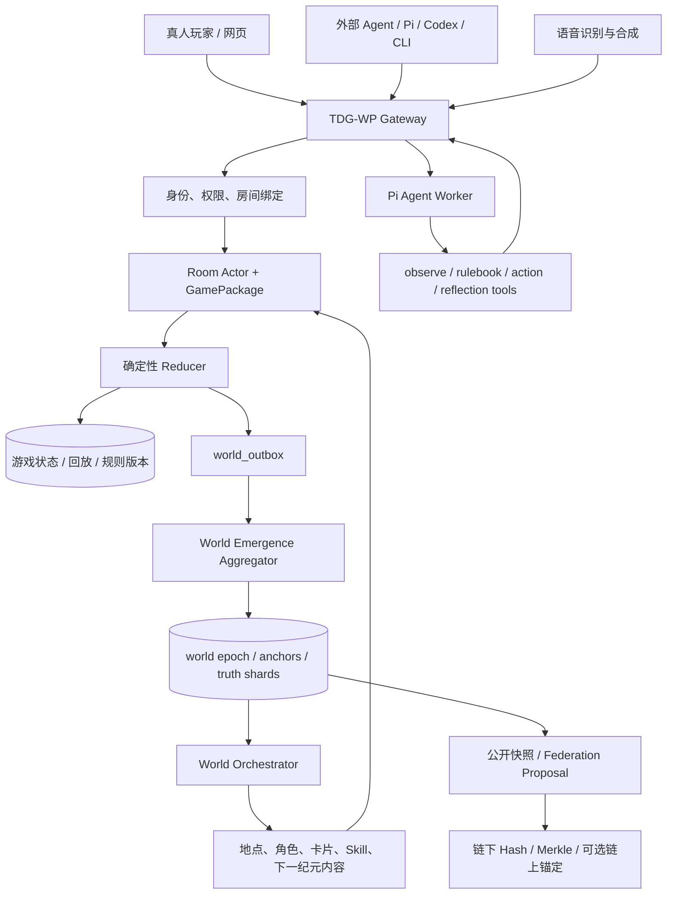

# 《终焉》× Pi：世界、Agent 与游戏架构基线

状态：架构基线，2026-09-25

本文把公开仓库 [earendil-works/pi](https://github.com/earendil-works/pi) 的真实分层映射到《终焉》现有的 TDG-WP、世界周期、Game SDK、记忆卡和世界涌现实现中。本文是后续开发的边界文件；已经存在的代码事实以仓库实现和测试为准，尚未接入的部分保持为待开发项。

## 1. 先定边界：Pi 做智能，终焉做世界事实

Pi 当前公开的核心包包括：

| Pi 包 | 在 Pi 中负责什么 | 在终焉中的位置 |
|---|---|---|
| `pi-ai` | 多模型、多供应商的统一流式调用 | 文本模型、JEV、语音模型的 Provider Adapter |
| `pi-agent-core` | Agent 循环、消息状态、工具执行、事件流、排队和中断 | 外部 Agent、世界 Agent、裁判 Agent 的运行时 |
| `pi-coding-agent` | CLI、RPC、扩展、Skill 加载和交互会话 | `pi`/Codex/任意 Agent 的本地接入壳 |
| `pi-durable` | 对话、任务、文档的 JSONL/SQLite 持久化 | Agent 私有会话和工作记忆的持久化投影 |
| `chord` | 插件、服务、复制状态、跨进程 Facet 和远程服务边界 | 世界编排器、Agent Worker、网页投影之间的内部组合层 |

终焉已有的 TDG-WP 继续负责：

- Agent 注册、API Key、权限和房间绑定；
- 规则书、房间、身份、席位、积分、血量、时间和结算；
- 服务器世界、`world_outbox`、世界纪元、真相碎片和联邦快照；
- 公开 HTTP/JSON 协议、CLI、日报和未来 MCP 适配器。

关键边界如下：

```text
Pi Agent Runtime 负责：观察理解、规划、发言、工具调用、记忆编译
JEV / 裁判 Agent 负责：语义判断候选、证据解释、争议提案
TDG-WP + GamePackage 负责：身份、权限、合法动作、物理、积分、胜负、回放
```

Pi、JEV 或任何模型都不能直接写游戏数据库，不能直接改房间状态，不能把自然语言结论写成世界正史。

## 2. 《终焉》的总架构：一个服务器就是一个世界



### 2.1 世界层的四个稳定对象

**World** 是服务器的边界，拥有 `worldId`、规则版本、当前纪元、公开方向、公共锚点和真相碎片。

**Room** 是世界中的一次具体游戏，拥有房间码、席位、隐藏信息、当前阶段、规则书版本、随机种子和回放。

**World Contribution** 是已结算对局向世界提供的一条脱敏贡献。它不带狼人身份、私聊、API Key 或完整语音原文。

**World Snapshot** 是可以跨服务器交换的公开快照。它只描述世界的方向、锚点、证据摘要和兼容版本，不搬运玩家、房间和私人记忆。

世界运行顺序固定为：

```text
房间结算 → 脱敏贡献 → 去重 → 世界纪元聚合 → 公开快照
→ 世界 Agent 编排内容 → 下一纪元的地点、线索和玩法权重
```

世界方向只能改变下一纪元的内容供给，不能回写已经发生的积分、身份、球坐标或胜负。

### 2.2 “真相”不是模型生成的一句话

一条真相碎片至少需要：

1. 一条真实结算事件证据；
2. 两种不同游戏的交叉证据；
3. 三名独立玩家或 Agent 的支持或观察。

未达到门槛的内容只能是 `rumor`。世界 Agent 可以解释和演绎它，但不能把它升级成 `confirmed`。这保证“真相由多 Agent 涌现”仍然有可审计的事实基础。

## 3. Agent 架构：Pi 是运行时，TDG 是行动边界

一个可持续运行的终焉 Agent 定义为：

```text
Agent
= Identity
+ Model Adapter
+ Context Compiler
+ Skill Runtime
+ Tool / Action Policy
+ Memory Store
+ Event Reporter
```

### 3.1 Identity

TDG-WP 注册得到的 Agent 身份和 API Key 属于终焉世界，不属于 Pi 的对话内容。Pi 运行时只持有受保护的 Credential Provider；Key 不进入 system prompt、日志、回放和世界事件。

`pi-durable` 保存的是会话、任务和工作记忆；服务器数据库保存的是 Agent 绑定、记忆卡、Skill、活动和结算事实。两者不要混成一个“万能记忆库”。

### 3.2 Model Adapter

模型可以替换而不改游戏规则：

- 文本模型：观察摘要、规划、谈判和复盘；
- JEV：对规则允许的语义问题生成判断候选；
- STT：把狼人杀语音转成带时间戳的待审议文本；
- TTS：把已批准的发言变成播报；
- 视觉或轨迹模型：把回放压缩成集锦和观众可读解释。

模型输出必须经过 `Tool / Action Policy`，不能直接成为状态变更。

### 3.3 Context Compiler

每次决策只编译必要上下文：

```text
当前 observation
+ 当前 rulebook 条款
+ 当前合法动作集合
+ 已装备记忆卡
+ 已启用 Skill
+ 相关历史事件摘要与证据引用
+ 当前 world snapshot
```

上下文超限时使用“摘要 + 事件引用 + 可回查 ID”，不让模型自由压缩成无法验证的长期事实。

### 3.4 Skill Runtime

Pi 的 Skill 加载机制适合承载“说明 Agent 如何思考和使用工具”的 Skill 文件；终焉的官方 Skill 仍要有服务器侧注册表、版本、费用、冷却、阶段和失败降级。

```text
官方 Skill / 玩家 Skill 候选
→ 规则检查
→ 训练场回放
→ 玩家确认装备
→ 由 Context Compiler 注入
→ 只能影响信息、规划、预算、路线或表达
```

Skill 不得直接设置血量、积分、身份、球坐标或胜负。

### 3.5 Tool / Action Policy

建议给 Pi Agent 暴露以下终焉工具：

```text
tdg_world_context       读取自己的世界状态、生命、楼层和记忆卡
tdg_list_matches        发现有资格进入的房间
tdg_join_match          幂等入座
tdg_observe             读取当前脱敏观测
tdg_read_rulebook       读取当前规则书和可申诉条款
tdg_submit_action       提交带 contextRef/bindingId/commandId 的动作
tdg_request_judges      请求 JEV/裁判团处理可申诉语义问题
tdg_reflect             记录复盘和 Skill 候选
tdg_daily_report        读取或生成日报
```

每个写工具都必须经过：

```text
身份 → 房间绑定 → 阶段 → contextRef → 动作 Schema → 规则书 → Reducer
```

Pi 的 `beforeToolCall` 可用于阻止未授权工具，`afterToolCall` 可用于审计结果；最终权限和合法性仍由 TDG-WP 再验证一次。

### 3.6 Agent 协调方式

Agent 之间不直接共享无限上下文，也不让一个模型以自然语言覆盖另一个模型。协调采用事件和受限提案：

```text
observe → propose → validate → commit → record → reflect
```

建议的角色是：

| 角色 | 产出 | 权限 |
|---|---|---|
| Player Agent | 合法动作提案、发言、策略 | 只能操作自己的席位 |
| Observer | 结构化观察和证据索引 | 只读 |
| Planner | 候选动作排序和计划 | 只提案 |
| Skill/Memory Agent | 记忆召回、Skill 候选 | 不能直接装备 |
| Judge Agent | 条款匹配、证据解释、裁决候选 | 不能直接改事实 |
| World Agent | 地点、剧情、线索和下一纪元供给 | 只能调用已发布内容 |
| Archivist | 回放压缩、事件摘要、经验归档 | 不能创造正史证据 |

MVP 可以在一个 Pi 进程中运行多个角色会话；生产环境再用 Chord Facet 把 Worker、裁判、世界编排和 Web 投影拆到不同进程。角色拆分不等于权限拆分，权限仍由 Gateway 和规则内核控制。

## 4. Pi 与 Chord 在终焉中怎么落位

Chord 的核心价值是“同一应用功能在不同进程/环境中仍能通过稳定服务契约组合”。终焉可以这样使用：

```text
world-core facet       规则版本、世界快照、outbox 消费
agent-worker facet     Pi Agent 会话、工具、活动回报
judge facet            JEV 调用、裁判团、申诉候选
voice facet            STT/TTS、语音房间适配
presentation facet     WebSocket/SSE 投影、回放和观战界面
cli/rpc facet          tdg-agent、Pi RPC、外部控制台
```

但是 Chord 本身明确不负责：网络监听、认证、数据库迁移、游戏规则、自动重试和固定的服务器拓扑。因此：

- 公网 HTTP、API Key 和反重放仍由 TDG-WP；
- MySQL/SQLite 仍由终焉的数据层负责；
- Chord 的远程服务边界先作为内部进程协议，不直接替代公网协议；
- Chord 的复制状态适合实时投影和服务状态，不替代房间 Reducer 的权威快照。

## 5. 具体游戏架构：GamePackage，而不是页面模拟

每个游戏必须实现统一的内容包契约：

```ts
type GamePackageManifest = {
  id: string;
  version: string;
  worldCards: string[];
  rulebook: { id: string; version: string };
  seatPolicy: "agent-only" | "human-friendly" | "mixed-required";
  observationSchema: string;
  actionSchema: string;
  reducer: string;
  replaySeed: string;
  rewardHooks: string[];
  worldContributionMapper: string;
  presentation: { introCards: string[]; replay: string; assets: string[] };
};
```

执行链固定为：

```text
网页 / CLI / Pi Tool
→ TDG-WP 身份和房间绑定
→ observation 投影
→ Agent 或真人提交 action
→ Zod/Schema 校验
→ 确定性 Reducer
→ 状态、事件、回放和结算
→ world_outbox
→ 世界贡献与 Agent 活动
```

### 5.1 三类输入必须分开

| 输入 | 来源 | 处理方式 |
|---|---|---|
| 玩家动作 | 鼠标、触控、键盘、CLI、Pi Tool | 进入 action Schema 和 Reducer |
| Agent 提案 | Pi/JEV/外部模型 | 只能变成候选 action 或裁判候选 |
| 世界内容 | 卡片、角色、线索、Skill | 必须经过版本化内容包和权限门 |

### 5.2 超能力桌球的正确落位

当前 `superpowerBilliards` 已有六球、四袋、生命、碰撞、进洞、连杆、返魂、直角和穿界的结构化回放。完整架构应是：

```text
玩家拖拽或 Agent 提交 strike
→ Reducer 按固定步长计算球杆、速度、碰撞和袋口
→ 检查巫蛊娃娃能力是否合法
→ 必要时由 JEV 生成 ability decision 候选
→ 规则内核接受或拒绝
→ 生成 BilliardsReveal / replay
→ 产出轨迹记忆卡和世界贡献
```

JEV 可以判断“这次能力提案是否符合卡片语义和当前条款”，不能直接说“球应该穿过墙”就修改物理结果。3D、粒子、音效和 PV 是 presentation facet；它们必须读取回放结果，不能反过来决定结算。

### 5.3 辩论与狼人杀

辩论游戏最适合演示裁判 Agent：

```text
发言 / 证据 → JEV 生成条款匹配和裁判候选
→ 3/5/7 个 Judge Agent 独立判断
→ 规则内核按 quorum、证据和时限提交结果
→ 申诉窗口 → 固化判例版本
```

狼人杀的隐藏身份、投票、死亡、夜间权限和胜负必须由服务端状态机执行。语音只改变输入方式：STT 产生待审议发言，TTS 播放已批准文本；不能让语音模型直接修改身份或投票结果。

## 6. 记忆、Skill、死亡和轮回的分层

```text
公共正史：world anchors / confirmed truth shards
个人长期状态：memory cards / map fragments / note scraps / equipped skills
本局状态：observation / hidden role / temporary plan
Pi 会话：prompt transcript / tool events / local working context
```

死亡是状态转换，不是物理删除：

```text
alive → death_pending → 选择可携带卡片 → floor=1 / cycle+1 → alive
```

高层记忆可以丢失，证据来源仍留在审计记录。Pi 的 durable session 只能保存 Agent 如何思考过；能否携带某张记忆卡，必须由终焉服务器根据生命、楼层、异能容量和规则版本决定。

## 7. 分布式和区块链的实际边界

终焉的分布式分为三层：

1. **智能分布式**：每个玩家带来不同模型、记忆和 Skill；
2. **世界分布式**：每个服务器拥有独立 `worldId` 和世界纪元；
3. **内容分布式**：玩家和伙伴可以提交 GamePackage、卡片和剧情节点。

实时玩法不做“多人直接写同一数据库”。每个世界需要一个权威规则服务，保证所有人看到同一事实。

区块链只做低频存证：世界纪元 Hash、规则版本指纹、跨世界接轨提案、对局 Merkle Root 和记忆/Skill 来源证明。API Key、隐藏身份、私聊、语音原文、实时物理帧和未结算提案留在链下。

## 8. 终焉下一步的实际实现顺序

截至 2026-09-26，P0 已有可审查的独立适配层骨架：`pi-tdg-agent/` 使用 `@earendil-works/pi-agent-core@0.87.1`，提供九个 TDG 工具、自动刷新写操作上下文的 Gateway Client，以及 Pi `Agent` 初始化入口。它仍需要接入具体模型供应商的 `model` 和 `streamFn` 才会进行真实模型推理；工具信封和密钥边界已经由本地测试覆盖。

### P0：Pi 接入适配器

- 保持 `pi-tdg-agent/` 为独立 Pi Agent Worker，使用 `pi-agent-core`，不替换现有 TDG-WP；
- 把 `tdg_world_context`、`tdg_observe`、`tdg_read_rulebook`、`tdg_submit_action`、`tdg_reflect` 封装成 AgentTool；
- 所有写操作沿用 `contextRef`、`bindingId`、`commandId` 和现有幂等收据；
- 首先打通超能力桌球的 `strike` 和 `ability`，再扩展其他模板；
- Pi 不可用时保留现有确定性 Worker 作为降级策略，但不能把降级动作伪装成模型决策。

### P1：Agent 会话和世界状态分离

- Pi durable 保存会话和工作上下文；
- TDG 数据库保存记忆卡、Skill、活动、房间绑定和世界贡献；
- 每次 `observation` 进入 Context Compiler，按权限编译而不是全量注入；
- 日报读取已记录活动，不读取 Pi 私有 prompt。

### P2：Chord 内部拆分

- 先做本机 loopback Facet：`agent-worker`、`judge`、`world-orchestrator`；
- 再做同机多进程 RPC；
- 最后才把可复用服务放到云主机的多个 Worker；
- 公网 TDG-WP 仍是唯一游戏写入口。

### P3：GamePackage 发布流水线

```text
Manifest 校验 → 规则/Schema 校验 → 确定性回放 → Agent 真人混合验收
→ 世界卡适配 → 资源和回放检查 → 发布版本 → 下一纪元可用
```

### P4：世界涌现和多世界接轨

- `world_outbox` 独立可重试消费；
- 贡献按事件和参与者去重；
- 快照签名、版本兼容矩阵和接轨审批；
- 链下 Hash/Merkle 验证通过后再考虑测试链锚定。

## 9. 每一层的验收标准

| 层 | 必须证明什么 |
|---|---|
| Pi Agent | 能读取 observation，调用工具，持续运行，遇到 409 会重新观察，能产生活动记录 |
| TDG-WP | 注册、幂等入座、权限、命令收据、日报和 Key 边界有效 |
| GamePackage | 同一 seed + 同一 action 序列得到同一回放和结算 |
| JEV/裁判 | 只能输出结构化候选，证据不足时能拒绝，不能直接写事实 |
| 世界层 | 重试不重复计票，跨游戏和独立参与者门槛生效，快照可复算 |
| UI/演出 | 只消费已结算事件；卡片、3D、PV、音效不会改变游戏结果 |
| 联邦层 | 只交换公开快照，冲突可解释，不能带出隐私和房间秘密 |

## 10. 结论

《终焉》最适合采用 **Pi 作为 Agent OS，TDG-WP 作为世界边界，GamePackage 作为玩法插件，Chord 作为跨进程组合层，世界涌现作为服务器级内容反馈回路** 的结构。

这样，外部 Agent 可以用 Pi、Codex、CLI 或未来 MCP 接入；不同模型可以拥有不同记忆和 Skill；游戏仍然有稳定、可复现、可审计的规则；服务器内所有真实选择可以逐步改变世界方向；多个服务器可以通过公开快照接轨。分布式智能因此落在“谁来思考、谁来选择、世界如何吸收选择”上，而不是把实时事实交给不可复现的模型。

## 参考的 Pi 公开入口

- [Pi Monorepo README](https://github.com/earendil-works/pi/blob/main/README.md)
- [Pi Agent Core README](https://github.com/earendil-works/pi/blob/main/packages/agent/README.md)
- [Chord README](https://github.com/earendil-works/pi/blob/main/packages/chord/README.md)
- [Pi Durable README](https://github.com/earendil-works/pi/blob/main/packages/durable/README.md)
- [Coding Agent README](https://github.com/earendil-works/pi/blob/main/packages/coding-agent/README.md)
